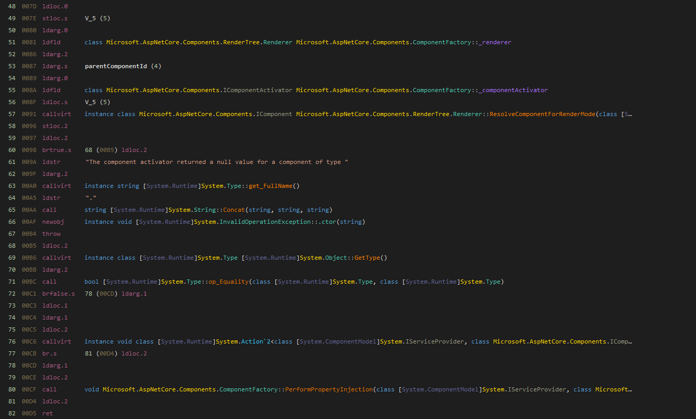
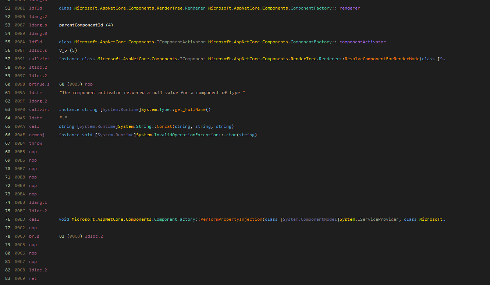

# Patch Instructions

## Binary Patch

To create the modified `Microsoft.AspNetCore.Components.dll` you'll need to use Windows and the [dnSpy](https://github.com/dnSpyEx/dnSpy) tool.

1. Open the original `Microsoft.AspNetCore.Components.dll` located in the global NuGet folder (if there is none, make sure to first run `dotnet build`) using dnSpy
2. In the `Microsoft.AspNetCore.Components` namespace locate the `ComponentFactory` class
3. Open the IL editor ("Edit Method Body") of the `InstantiateComponent` method
4. Replace all instructions related to calling the `callvirt` of the `System.Action` with `nop` instructions (essentially everything after the `throw` in instruction 67 to instruction 77)
5. Run "Save Module" and either overwrite it in the location or directly replace the patch file here

So the original should look like this:

And the modified version looks like this:

## Source Patch

These steps can be automated.

1. `git clone https://github.com/dotnet/aspnetcore.git`
2. `cd aspnetcore` (to project root)
3. `git apply /piral.blazor.source/tools/componentfactory-piral.patch` (don't forget to replace `/piral.blazor.source` with the path to the actual `Piral.Blazor` repository)
4. `cd src/Components` (from project root)
5. `./build.sh` (on Linux, otherwise `build.cmd` on Windows)
6. Usually it would be good to also build for Release afterwards; `cd Components/src` (from `src/Components`) and `dotnet build Microsoft.AspNetCore.Components.csproj -c Release`
7. Now use / copy `artifacts/bin/Microsoft.AspNetCore.Components/Release/net10.0/Microsoft.AspNetCore.Components.dll` (from project root) to the NuGet package dir
